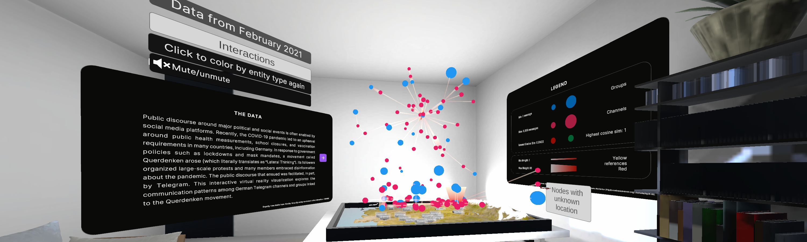

# Lateral Thinking Gone VR: Enabling Geospatial and Topical Insights in Virtual Reality

Andreas Bueckle1, Mudrika Alla1, Juhi Khare1, Kilian Buehling2,3

1 Department of Intelligent Systems Engineering, Luddy School of Informatics, Computing, and Engineering, Indiana University, Bloomington, IN 47408, USA\
2 Institute for Media and Communication Studies, Freie Universität Berlin, Berlin, Germany\
3 Weizenbaum Institute for the Networked Society, Berlin, Germany

## Before you start

More information about the debut of this application as part of the additional resouces of the [Places & Spaces Exhibit](https://scimaps.org/home) can be found at [https://scimaps.org/hosting/learning-material/lateral-thinking-gone-vr](https://scimaps.org/hosting/learning-material/lateral-thinking-gone-vr).

More information about the workshop of at ISSI 2023 can be found at [https://cns-iu.github.io/workshops/2023-07-02-issi-vr-workshop/](https://cns-iu.github.io/workshops/2023-07-02-issi-vr-workshop/)

## Video Demo

A video demo is available on [Youtube]() and embedded below:
<iframe width="560" height="315" src="https://www.youtube.com/embed/x_RaPMxPbyM?si=cqMatyfEiup1QBeZ" title="YouTube video player" frameborder="0" allow="accelerometer; autoplay; clipboard-write; encrypted-media; gyroscope; picture-in-picture; web-share" referrerpolicy="strict-origin-when-cross-origin" allowfullscreen></iframe>

## Main

Public discourse accompanying major political and social events is heavily facilitated by social media platforms.The spring of 2020 marked the beginning of the COVID-19 pandemic, which soon became the root of countless sociopolitical phenomena and movements. Across the world, the pandemic led to an upheaval surrounding public health measurements, school closures, lockdowns, and vaccination requirements. Germany initiated its first lockdown in March 2020 in response to the pandemic and became one of the first countries to face protests against pandemic measures and regulations. Of these protests, some were organized by a movement named Querdenken, which translates to “Lateral Thinking.” Although Querdenken took root in the southwestern city of Stuttgart, it evolved into a national movement with activity spanning several German cities. Its followers included a diverse array of individuals, ranging from pandemic skeptics to anti-lockdown protesters. During the COVID-19 pandemic, conspiracy theories and accompanying far-right narratives that became prevalent were largely spread via social media platforms. As a result, 2020 saw the rise of hybrid messaging app “Telegram” as a hub for COVID-19-related conspiracy theories and protest groups due to its low content regulation, with users being able to post, comment, and interact with content in anonymity relative to platforms like Facebook and Twitter. The growth of Querdenken was facilitated, in part, by Telegram. While platforms like Twitter and Facebook restrict and sanction content seen as harmful, smaller, less moderated platforms, such as Telegram, allow their users to post and interact with such content in relative anonymity. Because many fringe social media platforms have either evolved into outlets for extremism or have been explicitly founded for this aim, it is imperative to understand how the Querdenken movement became so widespread and prominent in Germany, particularly how its mobilization occurred in the online space of Telegram.

In this work, we present Lateral Thinking Gone VR, a narrative virtual reality (VR) visualization allowing users to explore cross-references and a geospatial layout of German-speaking Telegram groups and channels between April 2020 and December 2021. The application is available via Meta App Lab: [https://www.meta.com/experiences/6196572587047487](https://www.meta.com/experiences/6196572587047487)

The goal of Lateral Thinking Gone VR is threefold: (1) to understand the growth of the movement (i.e., how it spread); (2) to understand different relationships of importance (i.e., the frequency with which certain sources are cited in comparison to others); and (3) to visualize the relationship between topical and geospatial proximity.

The full dataset comprises data scraped from public Telegram communication between April 2020 and December 2021, focusing on 395 broadcast channels and group chats that prominently featured the term "Querdenken" in their name or description. In total, there were approximately 2.6 million messages exchanged within this network during this period. Notably, the data used for this visualization is specifically from February 2021; it has 46 nodes and 51 edges. The visualization is presented as a directed 3D network of channels and groups showing cross-references between entities and their weight. The network is laid out on a 3D map of the country on a living room table, with the Alps in the south and the North and Baltic Seas to the north, alongside 10 major German cities, including the federal capital Berlin. This geospatial and topical map demonstrates the push and pull between geospatial and topical proximity that dissolves or intensifies connections between chat groups (colored blue by default, where anyone can post) and broadcast channels (colored pink by default, where only admins can post). The present work creates a space and opportunity for users to enhance their comprehension of the Querdenken movement in an immersive environment. Additionally, the same data is laid out as a 3D network. Brush-and-link was implemented to select a node in one visualization and have it highlighted in the other. Clicking on a node with the left hand displays the node ID and the number of messages. Clicking on it with the right hand adds a new color coding, where all nodes are colored based on their cosine similarity value with the selected node along a topical vector (Information distribution and advertisement, conspiracy theories, mobilization, medical discussion, political discussion…). A detailed introduction to the data is provided elsewhere [1].

Crucial insights that can be drawn from the visualization are as follows:

- By closely observing the 3D network visualization and comparing the central nodes to their positions in the geospatial map, a pattern emerges. There is a higher concentration of central nodes in the southwest regions of Germany, suggesting that the movement had a strong presence in that area in February 2021.
- Major players in the Querdenken Movement are in the city of Stuttgart.
- Also, notice how there are isolated pairs of nodes. They form sub-components that have no major link to any of the more central nodes.
- There is a consensus on topics amongst most of the groups and channels. It is noteworthy that there are some outliers, which can be attributed to the entities having low number of messages.
- There appears to be no correlation between geospatial and topical proximity.

## References

[1] K. Buehling and A. Heft, “Pandemic Protesters on Telegram: How Platform Affordances and Information Ecosystems Shape Digital Counterpublics,” Soc. Media Soc., vol. 9, no. 3, Jul. 2023, doi: 10.1177/20563051231199430.
